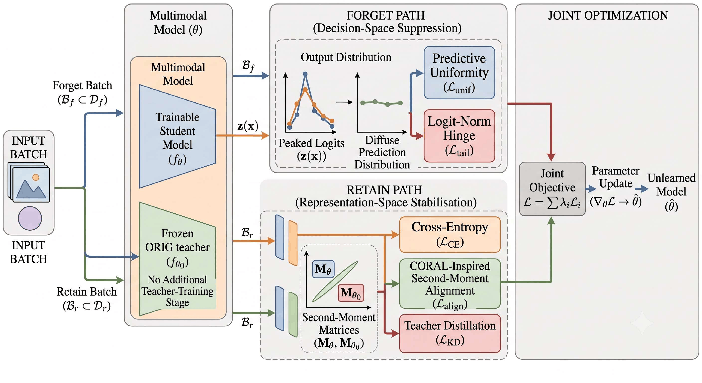
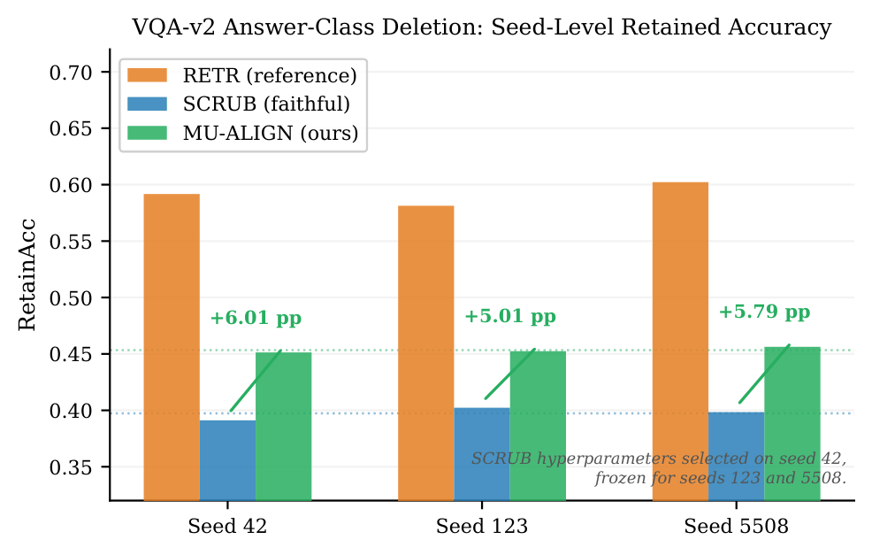
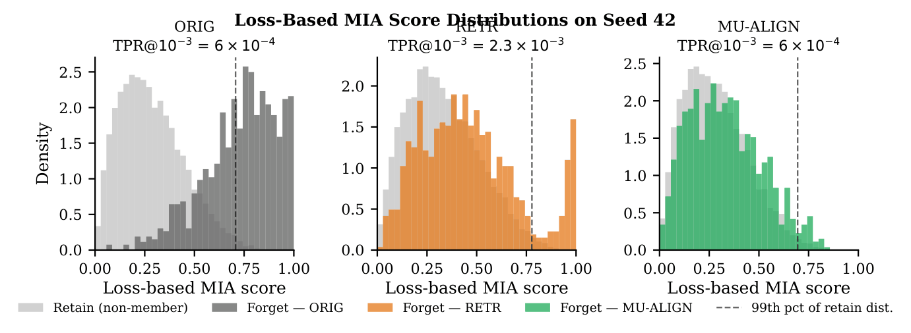
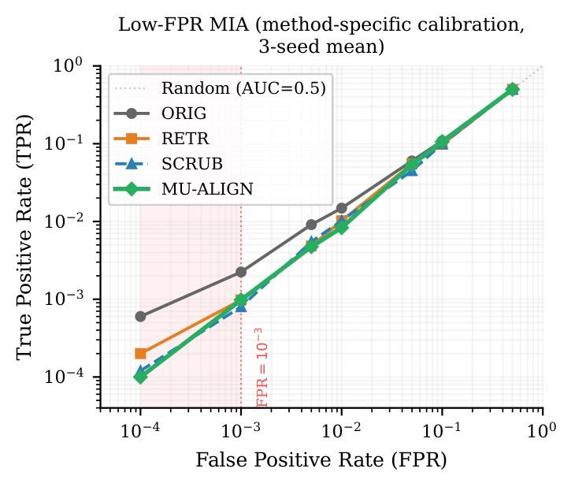
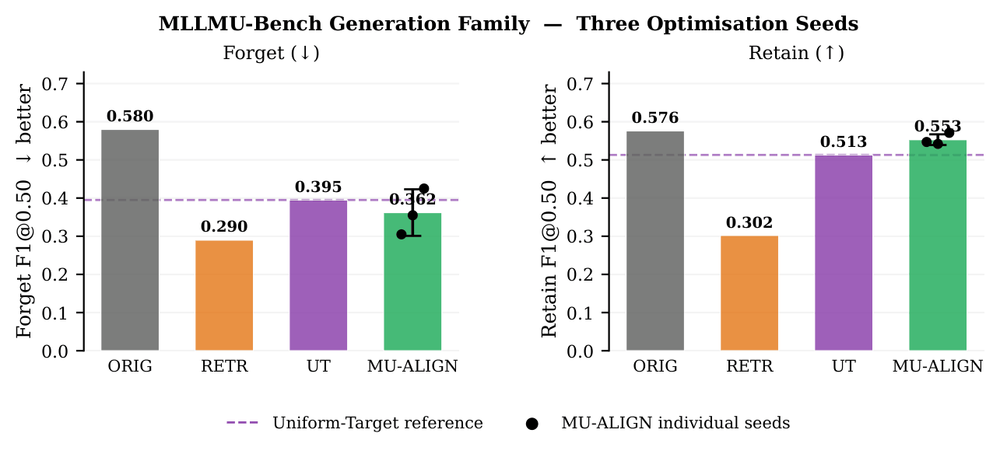

# MU-ALIGN: Tail-Suppressed Multimodal Machine Unlearning for Vision-Language Models

<p align="center">
  <a href="https://github.com/abdullahak07/MU-Align/blob/main/LICENSE">
    
  </a>
  <a href="https://www.python.org/">
    
  </a>
  <a href="https://pytorch.org/">
    
  </a>
  
  
</p>

<p align="center">
  <b>Knowledge-Based Systems (Under Review)</b> &nbsp;|&nbsp;
  <a href="#overview">Overview</a> &nbsp;|&nbsp;
  <a href="#main-results">Results</a> &nbsp;|&nbsp;
  <a href="#method">Method</a> &nbsp;|&nbsp;
  <a href="#quickstart">Quickstart</a> &nbsp;|&nbsp;
  <a href="#reproducibility">Reproducibility</a> &nbsp;|&nbsp;
  <a href="#citation">Citation</a>
</p>

---

# TL;DR

> **MU-ALIGN** is a multimodal machine unlearning framework designed for Vision-Language Models (VLMs). It combines **predictive uniformity**, **logit-tail suppression**, **CORAL-inspired second-moment alignment**, and **knowledge distillation from the original model** to improve the utility–forgetting trade-off.
>
> On the evaluated VQA-v2 benchmark, **MU-ALIGN achieves zero mean ForgetAcc while improving RetainAcc over faithful SCRUB by 5.60 percentage points across three independent seeds.** It also demonstrates stronger tail suppression and competitive low-FPR membership privacy under the evaluated loss-based attack protocol.

---

# Overview

<p align="center">

</p>

**MU-ALIGN** jointly optimizes two complementary objectives:

### Forget Path (Decision-Space Suppression)

- Predictive Uniformity
- Logit-Norm Hinge
- Suppresses residual high-confidence forgotten predictions

### Retain Path (Representation Stabilisation)

- Cross-Entropy supervision
- CORAL-inspired second-moment alignment
- Knowledge distillation from the frozen ORIG model

Unlike alternating optimisation approaches, both objectives are optimized **simultaneously in a single gradient update** for each balanced mini-batch.

---

# Motivation

Existing multimodal unlearning methods generally evaluate:

- Forget accuracy
- Retain accuracy
- Average membership inference AUC

However, these average metrics hide an important failure mode.

A small number of forgotten samples can retain extremely confident predictions, dominating worst-case privacy leakage despite appearing successful under average-case evaluation.

MU-ALIGN explicitly targets these residual high-confidence predictions while preserving retained utility.

---

# Main Results

## VQA-v2 (Three Independent Seeds)

<p align="center">

</p>

Across three independent random seeds:

| Method | ForgetAcc ↓ | RetainAcc ↑ |
|---------|------------:|------------:|
| Faithful SCRUB | 0.00036 ± 0.00063 | 0.3973 ± 0.0087 |
| **MU-ALIGN** | **0.00000 ± 0.00000** | **0.4533 ± 0.0066** |

**Key finding**

- Zero ForgetAcc on all three seeds
- +5.60 percentage-point RetainAcc improvement over faithful SCRUB
- Hyperparameters selected only on seed 42 and fixed for all remaining seeds

---

# Tail Suppression

<p align="center">

</p>

Average-case metrics such as AUC may remain nearly unchanged while a very small subset of forgotten samples dominates privacy leakage.

MU-ALIGN explicitly suppresses this residual high-confidence tail by combining:

- Predictive Uniformity
- Logit-Norm Hinge

This substantially reduces concentration of high-confidence forgotten predictions.

---

# Low-FPR Membership Privacy

<p align="center">

</p>

Membership inference is evaluated using disjoint calibration and evaluation non-members under three operating points:

- FPR = 10⁻²
- FPR = 5×10⁻³
- FPR = 10⁻³

Results show:

- Lower TPR than faithful SCRUB at FPR 10⁻² and 5×10⁻³
- Comparable privacy overall
- Neither method uniformly dominates across every operating point

---

# MLLMU-Bench Evaluation

<p align="center">

</p>

On the evaluated MLLMU-Bench generation task, MU-ALIGN:

- achieves lower forget performance,
- higher retained utility,
- and a larger selective utility–forgetting gap

than the evaluated Uniform-Target baseline.

The paper also documents a sentence-wrapping evaluation artefact in MLLMU-Bench and reports both raw and canonical evaluation for transparency.

---

# Method

The complete objective is

\[
\mathcal{L}
=
\mathcal{L}_{CE}
+
\lambda_a\mathcal{L}_{align}
+
\lambda_k\mathcal{L}_{KD}
+
\lambda_u\mathcal{L}_{unif}
+
\lambda_t\mathcal{L}_{tail}
\]

where

| Component | Purpose |
|------------|---------|
| Predictive Uniformity | Diffuse forgotten predictions |
| Logit-Norm Hinge | Suppress residual confidence tails |
| Cross Entropy | Preserve retained task performance |
| CORAL-inspired Second Moment Alignment | Stabilize retained representations |
| Knowledge Distillation | Reduce representation drift |

---

# Repository Structure

```text
MU-Align/
│
├── checkpoints/
├── configs/
├── data/
├── figures/
│   ├── flow.png
│   ├── fig_vqa_corrected.png
│   ├── fig_score_dist.png
│   ├── fig_lowfpr.png
│   └── fig_mllmu.png
│
├── models/
├── scripts/
├── results/
├── paper/
└── README.md
```

---

# Quickstart

Clone the repository

```bash
git clone https://github.com/abdullahak07/MU-Align.git

cd MU-Align
```

Create the environment

```bash
conda create -n mualign python=3.10

conda activate mualign
```

Install dependencies

```bash
pip install -r requirements.txt
```

---

# Reproducibility

The repository contains:

- Training code
- Evaluation scripts
- Hyperparameter configurations
- Three-seed evaluation protocol
- Tail analysis
- Low-FPR membership inference evaluation
- Figure generation scripts

The primary experiments use:

- VQA-v2
- Three independent seeds
- Fixed hyperparameters after seed-42 selection
- RTX 4090 GPU

---

# Current Scope

The current paper evaluates:

- ✅ VQA-v2
- ✅ Three independent seeds
- ✅ Faithful SCRUB comparison
- ✅ Tail suppression analysis
- ✅ Low-FPR loss-based membership inference
- ✅ MLLMU-Bench generation evaluation

The paper does **not** claim:

- certified machine unlearning
- superiority over full retraining
- architecture-independent generalisation
- exhaustive membership inference attacks

These remain directions for future work.

---

# Citation

```bibtex
@article{khan2026mualign,
  title={MU-ALIGN: Tail-Suppressed Multimodal Machine Unlearning for Vision-Language Models},
  author={Abdullah Ahmad Khan and Hamid Laga and Mohammed Kaosar and Ferdous Sohel},
  journal={Knowledge-Based Systems},
  year={2026},
  note={Under Review}
}
```

---

# Acknowledgements

This work was conducted at the **School of Information Technology, Murdoch University, Australia**.

---

## Contact

**Abdullah Ahmad Khan**

School of Information Technology

Murdoch University

GitHub: https://github.com/abdullahak07/MU-Align
